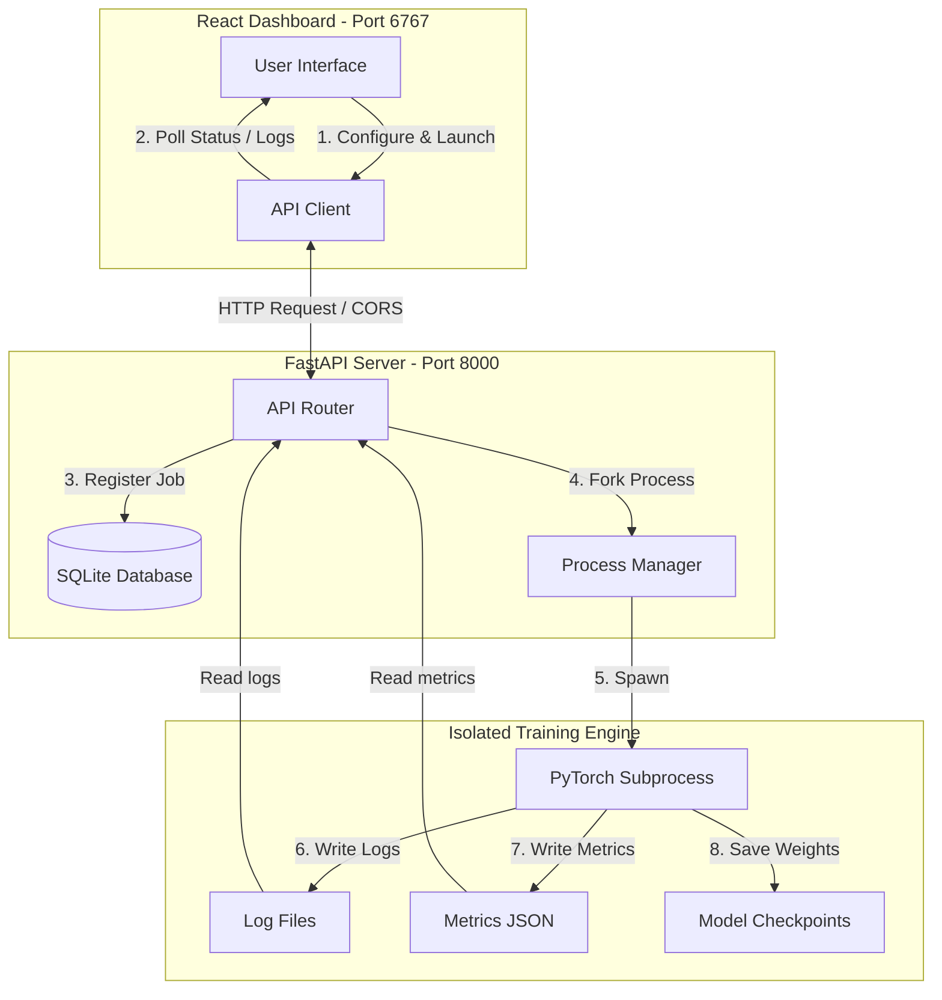

# Local LLM Training & Optimization Suite

A privacy-preserving infrastructure for Supervised Fine-Tuning (SFT) and Direct Preference Optimization (DPO) executed entirely on customer-managed environments. Optimized for resource-constrained hardware, this platform enables developers to train and optimize models locally while maintaining complete control over datasets, logs, and checkpoints.

---

## Technical Capabilities

* **Direct Preference Optimization (DPO)**: Optimizes policy weights directly from preference pairs, bypassing the overhead of reward model training and Reinforcement Learning with PPO.
* **Supervised Fine-Tuning (SFT)**: Adapts base models to target styles or instructions before preference alignment.
* **Hardware Optimization**: Supports NF4 (4-bit) QLoRA, activation checkpointing, and paged optimizers to enable efficient training on consumer-grade hardware.
* **Process Isolation**: Spawns independent sub-processes to run training, guaranteeing that 100% of CUDA VRAM is reclaimed by the operating system upon completion.

---

## System Architecture



---

## Local Development Setup

### Requirements
* **OS**: Linux, macOS, or Windows (NVIDIA GPU required for CUDA acceleration).
* **Software**: Python 3.10+, Node.js 18+.

### Installation
```bash
# Clone the repository
git clone https://github.com/preetdhanani/Local-llm-training-optimization.git
cd Local-llm-training-optimization

# Initialize virtual environment
python -m venv .venv
source .venv/bin/activate  # On Windows use: .venv\Scripts\activate

# Install dependencies
pip install -r requirements.txt

# Install frontend modules
cd dashboard
npm install
cd ..
```

### Starting the Application
```bash
python run_dev.py
```
This launches the FastAPI backend (port `8000`) and the React Vite dashboard (port `6767`) concurrently.

---

## Dataset Ingestion Standard

Datasets must be formatted as `.csv` or `.jsonl` files containing exactly these headers:

| Column Header | Description | Format Example |
| :--- | :--- | :--- |
| `prompt` | The query or instruction given to the model. | `"Explain gradient descent simply."` |
| `chosen` | The preferred aligned response or conversation. | `"Human: ... \n\nAssistant: [high-quality response]"` |
| `rejected` | The unaligned response to avoid. | `"Human: ... \n\nAssistant: [low-quality response]"` |

### Data Quality Filters:
* **Duplicate Detection**: Filters out records where both the prompt and chosen response are identical.
* **Empty Value Checking**: Drops rows containing missing, empty, or `None` values.
* **Minimum Character Lengths**: Ensures prompts exceed `min_prompt_len` (default: 10 characters) and responses exceed `min_response_len` (default: 3 characters).

---

## Verification Run (Smoke Test)

1. Launch the application: `python run_dev.py`
2. Open the dashboard at [http://localhost:6767](http://localhost:6767).
3. Set **Local Dataset Path** to: `test_datasets/standard_test_data.csv`
4. Set **Max Training Rows** to `3` (to limit execution size for verification).
5. Click **Run Full RLHF Pipeline**.
6. Monitor live log outputs and metrics in the dashboard views.

---

## License

This project is licensed under the terms of the MIT License. See [LICENSE](LICENSE) for details.
